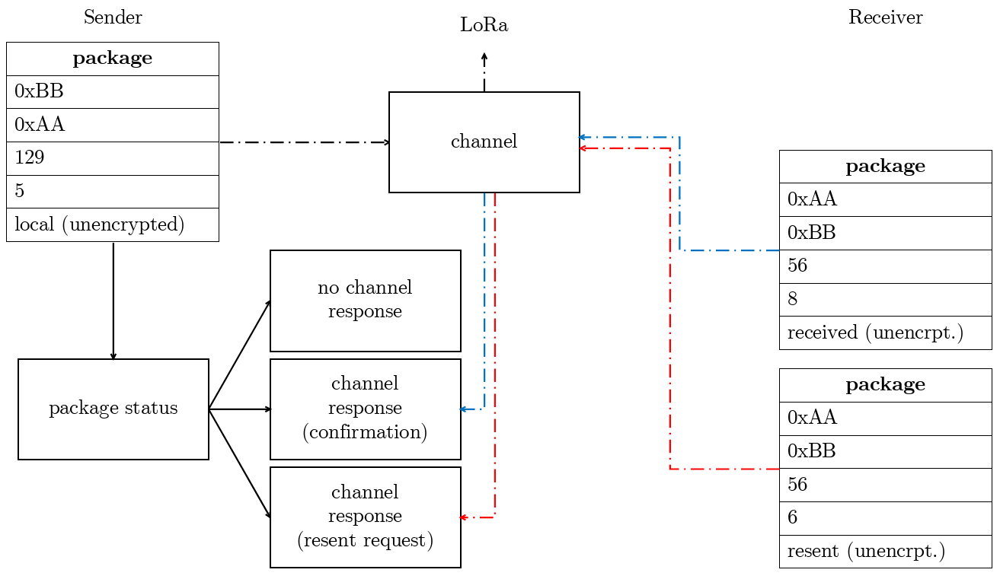
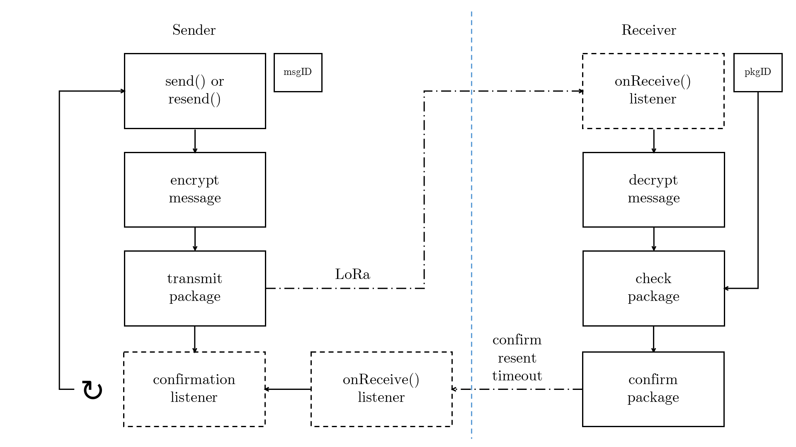

<p align="center"></img></p>

<a name="title"></a>
# esp32-LoraWAN
An example of implementing a secure data transmission protocol for LoraWAN.

## Table of Contents
* [Introduction](#introduction)
* [ESP32 Setup](#esp32-setup)
* [Overview](#overview)
  * [Problem definition](#problem-definition)
  * [Objective of the documentation](#objective-of-the-documentation)
* [Usage](#usage)
* [Open issues](#open-issues)
* [References](#references)

<a name="introduction"></a>
## Introduction

LoraWAN is a open, non encrypted data transmission protocol which uses *unlicensed radio spectrum in the Industrial, Scientific, and Medical (ISM) bands to enable low power and wide area communication between remote sensors* [4](#references) and different clients connected to the network. It usually uses three different frequency bands regarding to the local restrictions by several regions: 433E6 for Asia (433MHz), 866E6 for Europe (866MHz), 915E6 for North America (915MHz).

<a name="esp32-setup"></a>
## ESP32 Setup

Currently, we are using the LILYGO® TTGO LORA SX1278 ESP32 module, an ESP32 micrcontroller with an integrated LoRAWAN chip and an additional OLED display. 

<p align="center"></p>

### Hardware description

Our board consits of the following components:
- a [SX1278](https://www.semtech.com/products/wireless-rf/lora-transceivers/sx1278) LoRA WAN remote modem chip from Semtech
  - bidirectional send/receive module (but __not__ at the same time!) via SPI interface
  - 433MHz frequency, high sensitivity around -148dBm
  - +20dBm output power
  - data rates: 150 Mbps@11n HT40, 72 Mbps@11n HT20, 54 Mbps@11g, 11 Mbps@11b
  - transmit power: 19.5 dBm@11b, 16.5 dBm@11g, 15.5 dBm@11n
  - receiver sensitivity up to -98 dBm
  - UDP sustained throughput of 135 Mbps
- the main microcontroller also known as [ESP32](https://www.espressif.com/en/products/hardware/esp32/overview)
  - integrated WiFi module and antenna
  - integrated BLE module with antenna (same as for the WiFi)
  - Tensilica Xtensa LX6 dual core processor with up to 240MHz clock speed
  - 512kb RAM, 32bit architecture
  - operating voltage: 3.3V to 7V (powered by USB or external LiPo; charging/discharging circut onboard available)
  - operating temperature range: -40°C to +90°C
- [Adafruit OLED 1306](https://www.banggood.com/1_3-Inch-4Pin-White-OLED-LCD-Display-12864-IIC-I2C-Interface-Module-For-Arduino-p-1067874.html?rmmds=search&cur_warehouse=CN) 0.96" display with 128x64 pixel, I2C interface

First of all, we have to install several libraries to work with the current hardware setup. After installing the latest Arduino IDE version, we have to install the ESP32 core to our arduino installation like mentioned in the [ESP32-LoRa-Setup.md](https://github.com/josephpal/esp32-LoraWAN/blob/master/ESP32-LoRa-Setup.md) readme file. Therefore, an additional boards manager URL has to be added regarding to the following picture:

<p align="center"></p>

Confirm the window, go to ``Tools -> Board -> Boards Manager...``, search for esp32, confirm the installation and wait until all neccessary files are downloaded and set up. Now we can install the additional libraries to work with the OLED display or the LoRaWAN hardware. To get this done, open the menu entry under ``Tools -> Manage Libraries...`` and search for the following libraries [see also in [ESP32-LoRa-Setup.md](https://github.com/josephpal/esp32-LoraWAN/blob/master/ESP32-LoRa-Setup.md)] and install them one by one:

- LoRa by Sandeep Mistry
- Adafruit SSD1306
- Adafruit GFx

<p align="center"></p>

If the installation finished sucessfully, you should now be able to compile and run the basic LoRAWAN Send/Receive examples, which you can find under the sub directory ``examples/``. You only have to change the frequency band to 433MHz and choose the right hardware platform under ``Tools -> Board -> TTGO LoRa32-OLED V1 board``. Please keep in mind that each LoRaWAN device is theoretically capable of sending or receiving on all available frequency bands. But due to the fact that we have local restrictions by law which frequency band we are allowed to use, it is mandatory to use the one for your region.

For further information regarding the installation setup, please take a look into the created [ESP32-LoRa-Setup.md](https://github.com/josephpal/esp32-LoraWAN/blob/master/ESP32-LoRa-Setup.md) readme file.

### Pinout

The following picture shows a detailed overview of the current pin assignment the TTGO LORA SX1278 ESP32 module offers.

<p align="center"></img></p>

<a name="overview"></a>
## Overview

The next two chapters will focus on a short summary about the main problem using LoRaWAN as a transmission protocoll and the main aim of this project.

<a name="problem-definition"></a>
### Problem definition

There are two main problems in the transmission process using LoRaWAN. Like it was described earlier, LoraWAN is an open transmission channel, that means each message we send can be received from anyone else. Basically the protocol doesn´t contain an encryption process, so we have to encrypt the data on our own before sending it. However the LoRAWAN device is not capable of sending and receiving at the same time, so no bidirectional operation mode is available. To reduce package collision or package loss while sending and receiving, it is mandatory to implement a secure send and receive process like the CAN protocol already has. 

To guarantee a flexible and easy to use method on displaying the messages on the oled dispaly of our board, we have to implement - based on an example were an oled display was already in use - a class to handle that process. 

<a name="objective-of-the-documentation"></a>
### Objective of the documentation

The first step of our project will be to implement a ```LoRaHandler.h``` class, which contains the basic functions of sending, receiving, encrypting and decrypting messages. Furthermore methods like checking for package collision or message timout will be added. For displaying the results, a ```OLEDDisplay.h```class will be created, which guarantee an easy and flexibel access to the display for poping up the incomming messages.

In summary, the ```LoRaHandler.h``` class should fulfill the following aspects:
- setting up the device to get fully access to all hardware features
- sending messages
- receiving messages
- encryption and decryption of the transmission
- some kind of handshake between the communication partners (e.g. through exchanging a package id)
- package loss detection
- confirmation of every reveived package, after that a new transmission is allowed
- timeout handling
- package collison detection
- start transmission method (listen to the channel and request a transmission)

And for the ```OLEDDisplay.h```class:
- setting up the device be able to display text
- clear display method
- add a text string to the display and specify the textsize
- automatic handling of displaying text with different textsizes
- a infinitely text scroll mode, each new text message independent which textsize will be added to a new line and a method will take care of scrolling up the old content

<a name="usage"></a>
## Usage

To get started with our created class, we have to include the ```LoRaHandler.h``` header file in our arduino project. Now its necessary to declare a global pointer of the LoRaHandler class, so every thread which will be instantiated has access to the member functions.

```cpp
#include "LoRaHandler.h"

LoRaHandler *lora;
char *encryptionKey = "abcdefghijklmnop";

void setup() {
    /* initialize serial monitor */
    Serial.begin(115200);

    /* initialize LoRa WAN device */
    lora = new LoRaHandler();

    /* specify sender and receiver address */
    lora->initialize(0xAA, 0xBB);

    /* transmission will be encrypted */
    lora->initEncryption(encryptionKey);

    /* start listining in the background for new incomming messages */
    lora->startReceiveListner();
}

void loop() {
    delay(500);
    lora->send("broadcast", 0xFF);
    delay(500);
    lora->send("local");
}
```

If we want to encrypt our transmission, we have to define a cipher key. However, it is mandatory that both communication partners have the same key stored, so that they are able to encrypt and decrypt the sent and received packages due to the fact that we are using a [symetric encryption](https://en.wikipedia.org/wiki/Advanced_Encryption_Standard). To send a message, we have to call the method send and by passing an address, we can define to whom the package will be send to. Our device address system can be found in the following table:

| address  | description |
| --- | --- |
|  0x00 |  |
| ... |  |
| 0xFE | device address space |
| 0xFF  | reserved broadcast address  |

Each package we transmit doesn't only contain the message itself, furthermore it contains a lot more, which is necessary for example to identify whether the package is dedicated for me or not or to recognize we lost a package during our tranmission. For these scenarios and the ones we mentioned [above](#objective-of-the-documentation), it is obligated to create for each message a package, which contains a package header and the message we want to transmit. 

So basically a package consists of the information below and can be also found the the class property ```String package[]``` of the ```LoRaHandler.h``` class:
- destination address
- sender address
- message or package id
- unencrypted payload length
- encrypted payload or message

### transmission process

To point out which information will be transmitted, we will make a short example of transmitting the message "local".
Let's say a handshake between both communication partners was already done and they transmitted so far 128 packages. So our next package number will be the last number incremented by one. Our message itself has five characters, after encrypting the payload of our package we will have 16 characters (for more information about the encryption process please take a look at this [sub-repository](https://github.com/josephpal/esp32-Encrypt/blob/master/documentation/Cipher-class-explanation.pdf)). Encrypting the string "local" with the ciphering key mentioned above will result into the following text phrase

``` 
    cipher->encrypt("local") -> Ó ñ . . K ¶ Ý " Õ ¢ È • -  . V
```

or displayed as hex values:

``` 
    cipher->encrypt("local") -> d3 f1 92 87 4b b6 dd 22 d5 a2 c8 95 2d 90 0e 56 
```

Predefined the sender address will be set to ```0xAA``` and our receiver will listen on ```0xBB```. Please keep in mind, that in reallity we don't have sender and receiver, because usually we have a bidirectinal communication. Each sender is at the same time a receiver as well and reversed. Nevertheless our package we will transmit will look like mentioned below:

| description  | content |
| --- | --- |
|  destination address | 0xBB |
| sender address | 0xAA |
| package id | 129 |
| payload length  | 5 |
| encrypted message | Ó ñ . . K ¶ Ý " Õ ¢ È • -  . V |

Every package has a kind of life cycle. After a package is created and transmitted, the sender will wait until he receives a confirmation, a resent request or a timeout. Those three cases are possible, because either a package get lost, or our information in the package header is corrupted. In both cases the receiver will request to sent the package again. It is also possible that the receiver never received our package and in case we didn't implemented a timeout functionallity, we would wait infinitely for a response.

<p align="center"></img></p>

If a confirmation packages is received by the sender, he can proceed sending a new messgae. In case of a timeout, we currently decided to send a new message instead of trying to send the old message again (has to be done in file ```LoRaHandler.cpp```, line 240 and following). If the sender receives a resent request, the already as transmitted marked message will be resent and as long as he won't receive a confirmation or timeout a new transmission is blocked.

Each package which is transmitted will be count, for sending, the current number of sent packages will be stored in the ```LoRaHandler.h``` class property ```msgCount``` (equivalent to msgID) and for receiving in ```lastPacketID``` (equivalent to pkgID). Like mentioned above, this is necessary for detecting package loss and therefore mandatory for creating a resent request. Both communication partners have those two counters. For the handshake process, the ```lastPacketID``` counter from the receiver will be set to the ```msgCount``` of the sender, so the next package will have the id equal to the ```lastPacketID``` incremented by one. The two ```msgCount``` counters can be out of sync, because also the receiver in case of sending a confirmation package (received, resent) will count his transmitted packages and the sender will check the package number of the confirmation as well.

A confirmation of a confirmation package itself is prohibited, otherwise we would fall into a closed loop. This also applies in the event of a resent request (note: this case is currently note implemented!).

<p align="center"></img></p>

The whole process during sending a package and processing the response is shown in the picture above.

<a name="open-issues"></a>
## Open issues

Still, this implementation of a LoRaWAN protocol is in an early state and there is still a lot of work to do. The list below includes known issues as well as missing implementation parts:

- so far, start a transmission and communicate bidirectional is not handled properly. A method to listen to the channel if its free as well as asking for starting a transmission is mandatory to guarantee a stable transmission.
- a resent request of a broken resent package will result into a infinitely closed loop as mentioned for the confirmation case (confirm the confirmation of the confirmation package ...).
- packages which timed out should be resent form the sender.
- optimizing the encryption process. Sometimes the decrypted result doesn't match with the transmitted payload length. We were able to trace back the issue to the sender, it seems that sometimes there is a problem during encrypting and transmitting, but not on the receiver side.

<a name="references"></a>
## References
&emsp;***[1]*** [*Banggood homepage*](https://www.banggood.com/2Pcs-LILYGO-TTGO-LORA-SX1278-ESP32-0_96-OLED-Display-Module-16-Mt-Bytes-128-Mt-bit-433Mhz-For-Arduino-p-1270420.html?rmmds=search&cur_warehouse=CN)  
&emsp;***[2]*** *Lora WAN example on* [*randomnerdtutorials*](https://randomnerdtutorials.com/esp32-lora-rfm95-transceiver-arduino-ide/)  
&emsp;***[3]*** *Installing Arduino IDE on* [*Windows*](https://randomnerdtutorials.com/installing-the-esp32-board-in-arduino-ide-windows-instructions/)  
&emsp;***[4]*** *Lora WAN example on* [*instructables*](https://www.instructables.com/id/ESP32-Long-Distance-LoRaWan/)  
&emsp;***[5]*** *Hardwaresetup* [*ESP32*](https://github.com/josephpal/esp32-LoraWAN/blob/master/ESP32-LoRa-Setup.md)  
&emsp;***[6]*** *Adafruit OLED display* [*class*](https://github.com/adafruit/Adafruit_SSD1306)  
