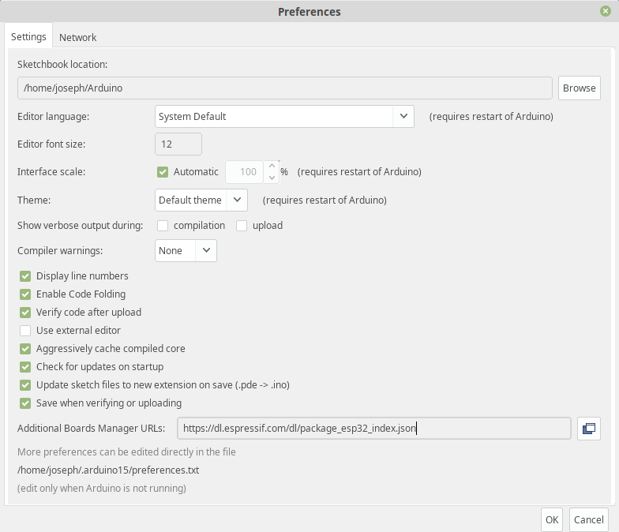
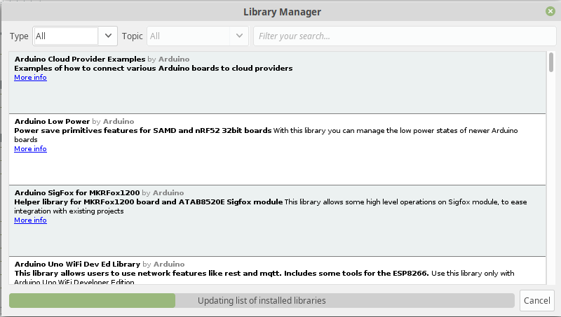

</img>

# esp32-LoraWAN
An example of implementing a secure data transmission protocol for LoraWAN.

## Table of Contents
* [Introduction](#introduction)
* [ESP32 Setup](#esp32-setup)
* [Overview](#overview)
  * [Problem definition](#problem-definition)
  * [Objective of the documentation](#objective-of-the-documentation)
* [Usage](#usage)
* [References](#references)

## Introduction

LoraWAN is a open, non encrypted data transmission protocoll, which uses *unlicensed radio spectrum in the Industrial, Scientific, and Medical (ISM) bands to enable low power and wide area communication between remote sensors* [4](#references) and different clients connected to the network. It usually uses three different frequency bands regarding to the local restrictions by several regions: 433E6 for Asia (433MHz), 866E6 for Europe (866MHz), 915E6 for North America (915MHz).

## ESP32 Setup

Currently, we are using the LILYGO® TTGO LORA SX1278 ESP32 module, an ESP32 micrcontroller with an integrated LoRAWAN chip and a additional OLED display. 

### Hardware description

Our board consits of the following components:
- a [SX1278](https://www.semtech.com/products/wireless-rf/lora-transceivers/sx1278) LoRA WAN remote modem chip from Semtech
  - bidirectional send/receive module (but __not__ at the same time!) via SPI interface
  - 433MHz frequency, high sensitivity around -148dBm
  - +20dBm output power
  - Data rates: 150 Mbps@11n HT40, 72 Mbps@11n HT20, 54 Mbps@11g, 11 Mbps@11b
  - Transmit power: 19.5 dBm@11b, 16.5 dBm@11g, 15.5 dBm@11n
  - Receiver sensitivity up to -98 dBm
  - UDP sustained throughput of 135 Mbps
- the main microcontroller also known as [ESP32](https://www.espressif.com/en/products/hardware/esp32/overview)
  - integrated WiFi module and antenna
  - integrated BLE module with antenna (same as for the WiFi)
  - Tensilica Xtensa LX6 dual core processor with up to 240MHz clock speed
  - 512kb RAM, 32bit architecture
  - operating voltage: 3.3V to 7V (powered by USB or external LiPo; charging/discharging circut onboard available)
  - operating temperature range: -40°C to +90°C
- [Adafruit OLED 1306](https://www.banggood.com/1_3-Inch-4Pin-White-OLED-LCD-Display-12864-IIC-I2C-Interface-Module-For-Arduino-p-1067874.html?rmmds=search&cur_warehouse=CN) 0.96" display with 128x64 pixel, I2C interface

First of all, we have to install several libraries to work with the current hardware setup. After installing the latest Arduino IDE version, we have to install the ESP32 core to our arduino installation like mentioned in the [ESP32-LoRa-Setup.md](https://github.com/josephpal/esp32-LoraWAN/blob/master/ESP32-LoRa-Setup.md) readme file. Therefore, an additional boards manager URL has to be added regarding to the following picture:

Confirm the window, go to ``Tools -> Board -> Boards Manager...``, search for esp32 with confirming the installation and wait until all neccessary files are downloaded and set up. After that you are able to proceed with the next steps. Now we can install the additional libraries to work with the OLED display or the LoRaWAN hardware. To get this done, open the menu entry under ``Tools -> Manage Libraries...`` and search and install the following libraries [see also in [ESP32-LoRa-Setup.md](https://github.com/josephpal/esp32-LoraWAN/blob/master/ESP32-LoRa-Setup.md)]:

- LoRa by Sandeep Mistry
- Adafruit SSD1306
- Adafruit GFx

If the installation finishes sucessfully, you should now be able to compile and run the basic LoRAWAN Send/Receive examples, which you can find under the sub directory ``examples/``. You only have to make sure to change the frequency band to 433MHz, and choosing the right hardware platform under ``Tools -> Board -> TTGO LoRa32-OLED V1 board``.

For further information regarding the installation setup, please take a look into the created [ESP32-LoRa-Setup.md](https://github.com/josephpal/esp32-LoraWAN/blob/master/ESP32-LoRa-Setup.md) readme file.

### Pinout

In the following picture shows a detailed overview about the current pin assigment of the TTGO LORA SX1278 ESP32 module.

</img>

## Overview

The next to chapters will focus on a short summary about the main problem using LoRaWAN as an transmission protocoll and the main aim of this project.

### Problem definition

There are two main problems in the trasmission process. Like it was descriebed earlier, LoraWAN is an open system, tht means everyone can use it. Thats why we have to check if the channel isn't used before sending something. The second problem is a security problem. The LoraWAN protocol doesn´t conntain an encryption process, so we have to encryped the data on our own before sending it. The last smal problem is the comunicaation with the dispaly. Even though we have an example it is some code necessary to cofigururate the display and show text on it, so it would be an advantage to organise this.

### Objective of the documentation

So we have two aims for this project. First of all, we have to develop two classes. One bigger one for the LoraWAN system and a smaller one for the display. The second aim is the realization of an encrypion and a descrytion for the data. 

## Usage

*TODO*: Example call of our created class, description what is necessary and which parameters are passed. Explanation of the thread communication.

## References
&emsp;***[1]*** [*Banggood homepage*](https://www.banggood.com/2Pcs-LILYGO-TTGO-LORA-SX1278-ESP32-0_96-OLED-Display-Module-16-Mt-Bytes-128-Mt-bit-433Mhz-For-Arduino-p-1270420.html?rmmds=search&cur_warehouse=CN)  
&emsp;***[2]*** *Lora WAN example on* [*randomnerdtutorials*](https://randomnerdtutorials.com/esp32-lora-rfm95-transceiver-arduino-ide/)  
&emsp;***[3]*** *Installing Arduino IDE on* [*Windows*](https://randomnerdtutorials.com/installing-the-esp32-board-in-arduino-ide-windows-instructions/)  
&emsp;***[4]*** *Lora WAN example on* [*instructables*](https://www.instructables.com/id/ESP32-Long-Distance-LoRaWan/)  
&emsp;***[5]*** *Hardwaresetup* [*ESP32*](https://github.com/josephpal/esp32-LoraWAN/blob/master/ESP32-LoRa-Setup.md)  
&emsp;***[6]*** *Adafruit OLED display* [*class*](https://github.com/adafruit/Adafruit_SSD1306)  
